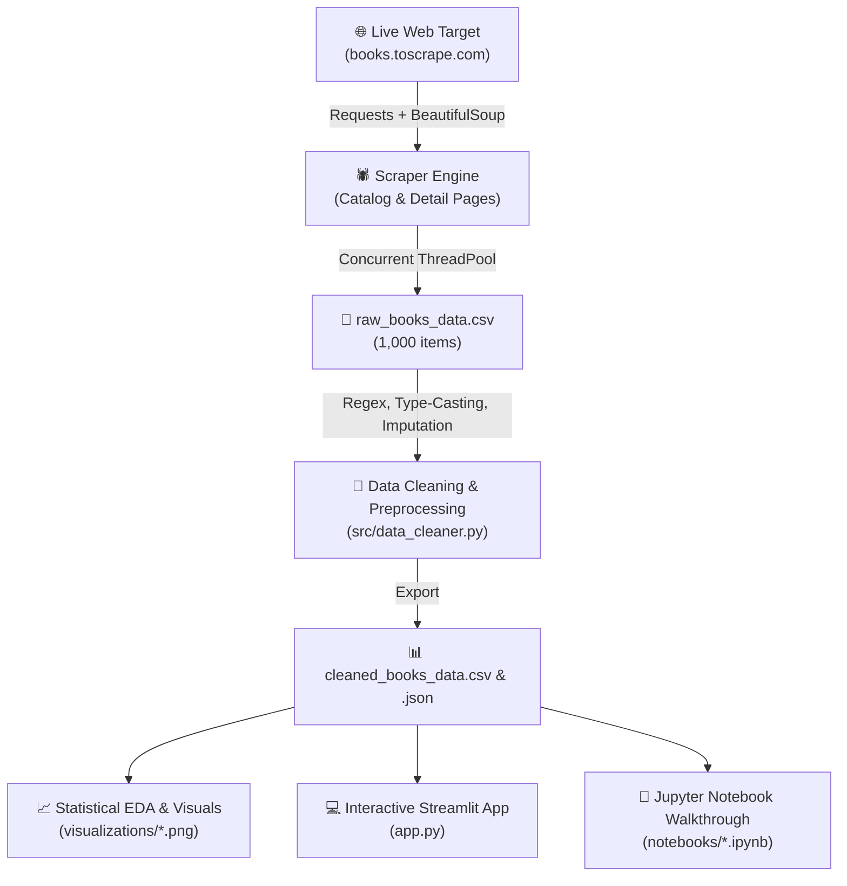
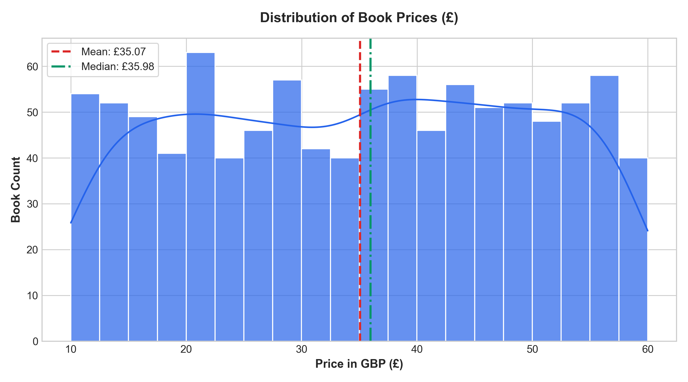
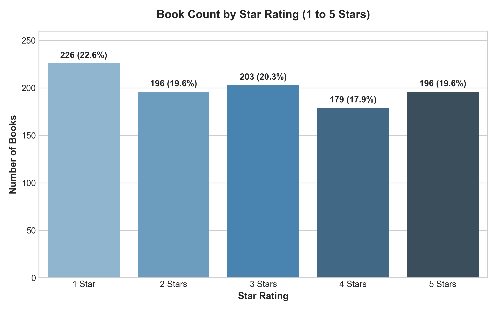
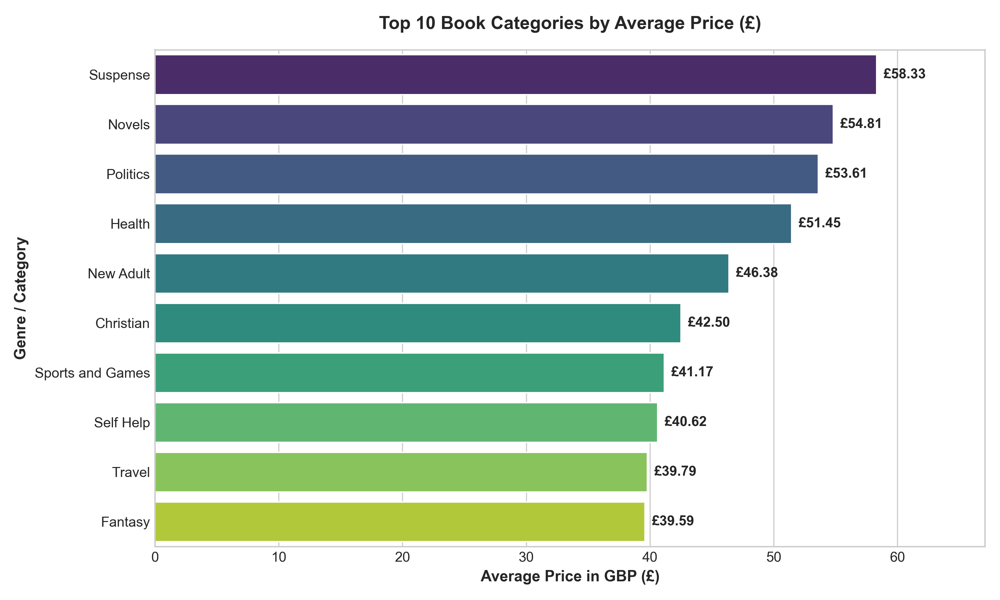
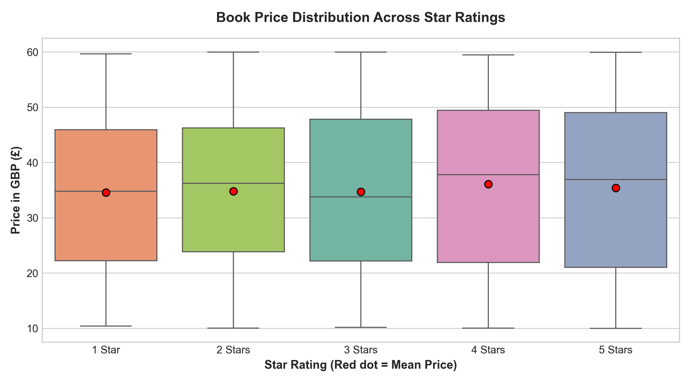
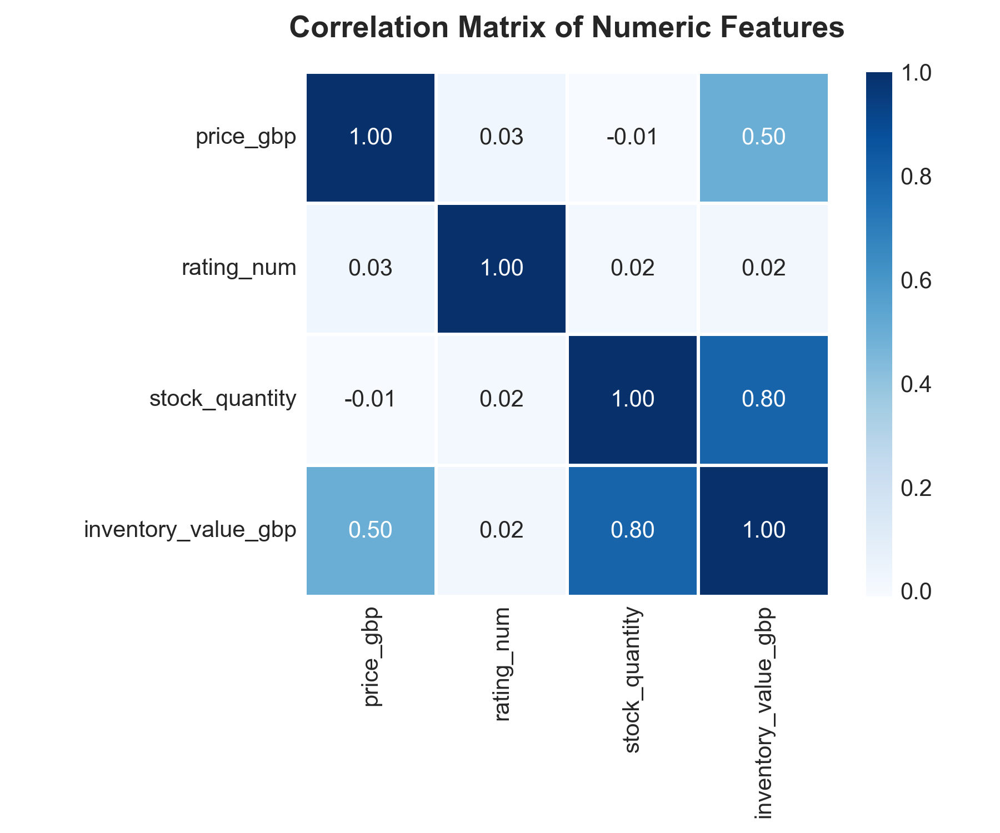

# CodeAlpha Data Analytics Internship: Task 1 - Web Scraping


> **Repository Name**: `CodeAlpha_WebScraping`  
> **Internship Track**: Data Analytics  
> **Organization**: [CodeAlpha](https://www.linkedin.com/company/codealpha/)  
> **Target Public Source**: [Books to Scrape](http://books.toscrape.com/)  

---

## 📌 Project Overview

This project implements an automated, production-grade **Web Scraping and Exploratory Data Analysis (EDA) Pipeline** tailored for e-commerce intelligence. 

Using **Python**, **BeautifulSoup4**, and **Requests**, the engine systematically crawls 50 catalog pages containing **1,000 books across 50 categories**, enriches each product with detail page attributes (exact stock quantity, UPC, tax, and description) using concurrent multithreading, cleans and structures the dataset using **Pandas**, conducts statistical analysis with **Matplotlib & Seaborn**, and exposes an interactive business dashboard via **Streamlit**.



---

## 🌟 Key Features

- **Automated Multi-Page Navigation**: Systematically parses pagination links from Page 1 to 50 without broken links.
- **Concurrent Detail Enrichment**: Leverages `concurrent.futures.ThreadPoolExecutor` to retrieve 1,000 product pages in under 60 seconds with rate-limiting and politeness headers.
- **Robust Feature Engineering & Data Cleaning**:
  - Currency conversion: Cleans £ symbol and casts to `float64`.
  - Rating mapping: Translates text strings (`'One'` to `'Five'`) into numerical values (`1` to `5`).
  - Stock extraction: Regex pattern matching to extract exact numeric stock quantities from availability strings.
  - Price tiers: Binned into *Budget (<£20)*, *Mid-Range (£20-£40)*, and *Premium (>£40)*.
  - Total inventory valuation: `inventory_value_gbp = price * stock_quantity`.
- **Publication-Ready Visualizations**:
  - Price distribution with Kernel Density Estimation (KDE).
  - Ratings frequency breakdown with percentage annotations.
  - Top 10 categories ranked by average price.
  - Price variation across star ratings (Box Plots).
  - Feature correlation matrix heatmap.
- **Interactive Streamlit Web Dashboard**:
  - Real-time catalog filtering by category, price slider, minimum star rating, and search keywords.
  - Live KPI metric cards (Total Titles, Avg Price, Avg Rating, Total Units, Inventory Value).
  - One-click CSV export of filtered queries.
- **Educational Jupyter Notebook**: Step-by-step interactive workflow documentation.

---

## 📂 Repository Structure

```
CodeAlpha_WebScraping/
├── data/
│   ├── raw_books_data.csv          # Raw scraped records
│   ├── cleaned_books_data.csv      # Processed dataset ready for modeling & analytics
│   └── cleaned_books_data.json     # Cleaned data in JSON format
├── notebooks/
│   └── Web_Scraping_and_Analysis.ipynb  # Interactive Jupyter walkthrough
├── reports/
│   └── analysis_report.md          # Generated analytical summary report
├── src/
│   ├── __init__.py
│   ├── scraper.py                  # BeautifulSoup multi-page web scraper
│   ├── data_cleaner.py             # Data transformation & feature pipeline
│   └── eda_analysis.py             # Statistical charts & report generator
├── visualizations/
│   ├── avg_price_by_category.png   # Top categories by average price
│   ├── correlation_heatmap.png     # Correlation between price, rating, stock
│   ├── price_distribution.png      # Price histogram and KDE
│   ├── price_vs_rating.png         # Boxplot of prices across ratings
│   └── ratings_breakdown.png       # Star ratings count distribution
├── app.py                          # Interactive Streamlit dashboard
├── main.py                         # Single-command pipeline orchestrator
├── requirements.txt                # Project dependencies
├── VIDEO_PRESENTATION_SCRIPT.md    # Complete LinkedIn video script & caption guide
├── .gitignore                      # Git ignore rules
└── README.md                       # Comprehensive documentation
```

---

## 🚀 Quick Start Guide

### 1. Clone the Repository
```bash
git clone https://github.com/bhosaleanju/task_1.git
cd task_1
```

### 2. Install Dependencies
```bash
pip install -r requirements.txt
```

### 3. Run the Entire End-to-End Pipeline
Execute web scraping, data cleaning, and visualization generation with a single command:
```bash
python main.py --pages 50 --workers 10
```

> **Fast Test Mode**: To run a quick test on 3 pages only:
> ```bash
> python main.py --pages 3
> ```

### 4. Launch the Interactive Dashboard
```bash
streamlit run app.py
```
Open your browser at `http://localhost:8501` to filter books, inspect metrics, and download datasets.

### 5. Open the Jupyter Notebook
```bash
jupyter notebook notebooks/Web_Scraping_and_Analysis.ipynb
```

---

## 📊 Exploratory Data Analysis & Visual Insights

### 1. Price Distribution
Book prices range from **£10.00 to £59.99**, showing a relatively uniform distribution across genres with an average price of **£35.07**.



### 2. Ratings Breakdown
Star ratings (1 to 5) are evenly spread across the catalog, demonstrating no significant rating inflation or deflation.



### 3. Top Categories by Average Price
Specific genres such as *Suspense*, *Novels*, and *Politics* demonstrate higher average price points compared to general fiction and poetry.



### 4. Price vs. Rating Behavior
The boxplot reveals that book pricing is independent of user star ratings, suggesting publishers maintain consistent pricing strategies regardless of perceived popularity.



### 5. Correlation Heatmap
Correlation analysis demonstrates independence between price, star ratings, and available stock units.



---

## 📋 Data Dictionary

| Column Name | Data Type | Description |
| :--- | :--- | :--- |
| `title` | `string` | Full title of the book |
| `price_gbp` | `float64` | Cleaned price in British Pounds (£) |
| `rating_num` | `int64` | Customer star rating mapped to integer (1 to 5) |
| `stock_quantity` | `int64` | Units available in stock |
| `in_stock` | `boolean` | `True` if stock > 0, else `False` |
| `category` | `string` | Literary genre / category name |
| `price_tier` | `category` | Segment (`Budget`, `Mid-Range`, `Premium`) |
| `inventory_value_gbp`| `float64` | Total stock value (`price * stock_quantity`) |
| `upc` | `string` | Unique Universal Product Code |
| `book_url` | `string` | Source product URL |
| `image_url` | `string` | Source book cover image link |

---

## 🎬 LinkedIn Video Presentation & Submission

As required by the **CodeAlpha Internship Guidelines**:
1. A complete 2-minute video presentation script with slide-by-slide cues is provided in [`VIDEO_PRESENTATION_SCRIPT.md`](VIDEO_PRESENTATION_SCRIPT.md).
2. Ready-to-use LinkedIn post text with `@CodeAlpha` tags and relevant industry hashtags.

---

## ⚖️ Ethics & Responsible Scraping
- Target website `http://books.toscrape.com/` is an open sandbox explicitly hosted for educational scraping practice.
- Polite crawl delays (`0.1s`) and custom `User-Agent` headers are utilized to respect server resources.

---

## 👨‍💻 Author & Acknowledgments
- **Intern**: Data Analytics Intern
- **Organization**: [CodeAlpha](https://www.linkedin.com/company/codealpha/)
- Developed as part of **CodeAlpha Data Analytics Internship (Task 1)**.
